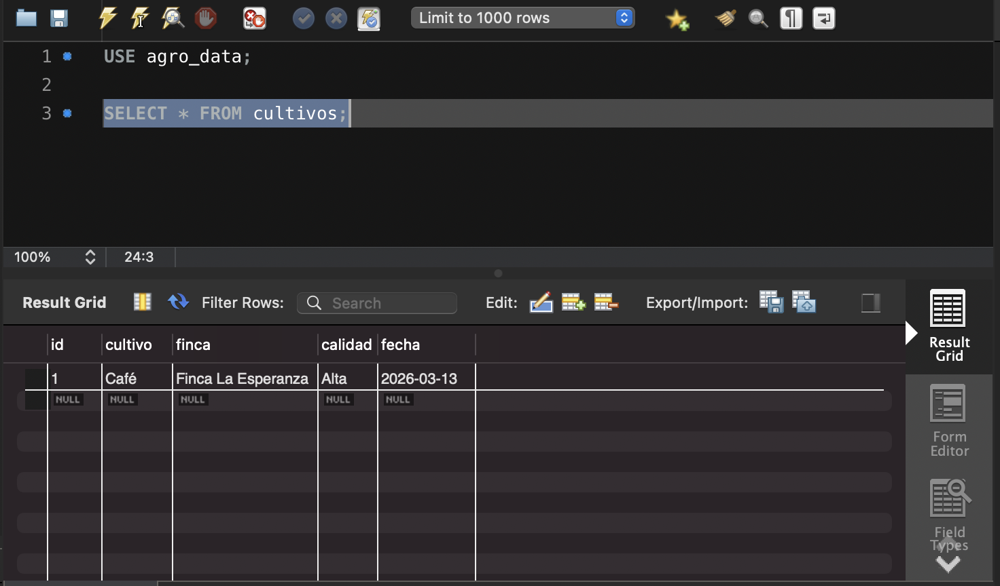
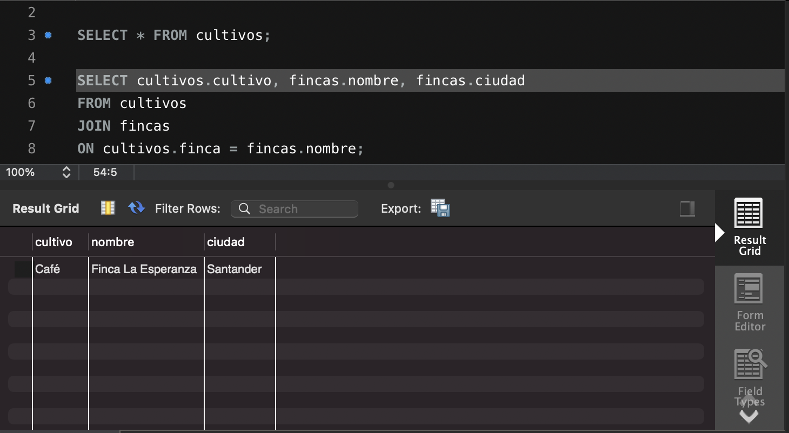
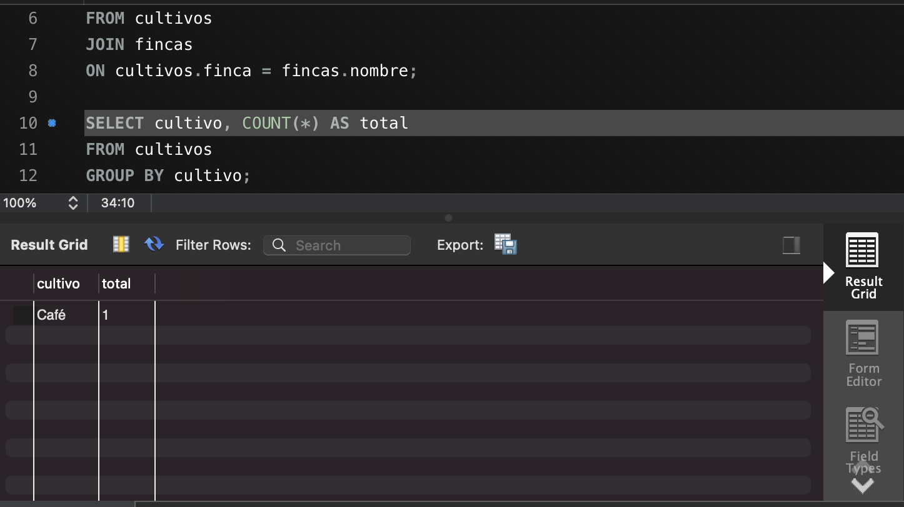

# Agro Data Manager

Proyecto de práctica utilizando **MySQL y SQL** para gestionar datos de cultivos y fincas.

## Descripción

Este proyecto consiste en el diseño de una base de datos para registrar información de cultivos agrícolas y fincas.

Se implementan consultas SQL para manipular y analizar datos.

## Tecnologías utilizadas

- MySQL
- SQL
- Git
- GitHub

## Funcionalidades implementadas

El proyecto incluye consultas SQL para:

- Crear base de datos
- Crear tablas
- Insertar registros
- Consultar información
- Filtrar datos con `WHERE`
- Ordenar resultados con `ORDER BY`
- Contar registros con `COUNT`
- Agrupar datos con `GROUP BY`
- Unir tablas con `JOIN`
- Actualizar registros con `UPDATE`
- Eliminar registros con `DELETE`

## Estructura del proyecto

agro-data-manager  
├ database.sql  
├ consultas.sql  
├ README.md  
└ screenshots  
&nbsp;&nbsp;&nbsp;&nbsp;├ select-cultivos.png  
&nbsp;&nbsp;&nbsp;&nbsp;├ join.png  
&nbsp;&nbsp;&nbsp;&nbsp;└ groupby-cultivos.png

## Query Results

### Select Cultivos

### Join Cultivos and Fincas

### Group By Cultivo

